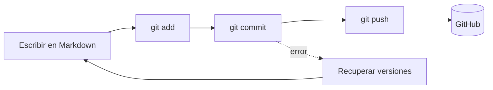

---
tags:
  - taller-ia
  - modulo-1
  - indice
modulo: 1
aliases:
  - Módulo I
  - Git y Markdown
---

> [!info] Módulo I. Entorno de trabajo y documentación
> Aprenderás a escribir y estructurar documentos en **Markdown** y a versionar tu trabajo con **Git** y **GitHub**. Es la base del resto del taller: los contextos, prompts y especificaciones que usarás con IA se escriben en Markdown y se guardan con control de versiones.

## Orden de lectura

1. [[01 Markdown]]: sintaxis básica y por qué es el formato preferido para trabajar con modelos de lenguaje.
2. [[02 Comandos básicos]]: `init`, `status`, `add`, `commit`, `log`, `diff`, `checkout` y `config`.
3. [[04 Recuperar versiones]]: inspeccionar el historial, descartar cambios y deshacer commits.
4. [[03 Github]]: conectar tu repositorio local a la nube por SSH o HTTPS.

## Mapa del flujo

## Material de apoyo

- [[Git, GitHub y Markdown]]: enlaces a documentación oficial, Mermaid, TikZ y plantillas para Obsidian.
- [[Índice de recursos del taller]]
