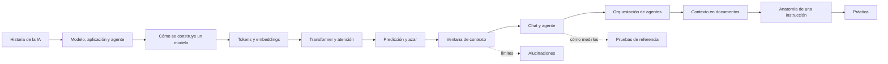

---
tags:
  - taller-ia
  - modulo-2
  - indice
modulo: 2
aliases:
  - Módulo II
  - Fundamentos de IA e instrucciones
---

> [!info] Módulo II. Fundamentos de IA e instrucciones
> Aprenderás qué es y cómo funciona un modelo de lenguaje, en qué se diferencia un chat de un agente, cómo darles contexto con documentos organizados y cómo escribir instrucciones que se puedan revisar. Estas notas desarrollan lo que la presentación solo pudo condensar: definiciones completas, ejemplos y los matices que quedaron fuera de las diapositivas.

> [!note] Cómo leer estas notas
> - Cada nota termina con una sección **Fuentes** con enlaces a la documentación oficial y a los artículos originales.
> - Los nombres de modelos, ventanas de contexto y cifras de empresas cambian cada pocos meses. Los de estas notas corresponden a la documentación oficial del 7 y 8 de octubre de 2026; antes de citarlos, revisa la página oficial.
> - Los ejemplos con números (fragmentos de texto, porcentajes) están calculados con herramientas reales cuando se indica; si no, son números inventados para ilustrar.

## Orden de lectura

**Antecedentes**

1. [[01 Historia de la IA]]: de la pregunta de Turing a los premios Nobel de 2024 y los resultados de la IA fuera del chat.

**Modelos, aplicaciones y agentes**

2. [[02 Modelo, aplicación y agente]]: tres cosas distintas que suelen llamarse «la IA» y qué modelos hay hoy.

**De dónde viene y cómo procesa el lenguaje**

3. [[03 Cómo se construye un modelo]]: arquitectura, preentrenamiento y ajuste; reglas escritas frente a reglas aprendidas.
4. [[04 Tokens e incrustaciones]]: cómo el texto se vuelve fragmentos y luego listas de números.
5. [[05 Pesos y parámetros]]: qué son los números que el modelo ajusta al entrenarse.
6. [[06 Transformer y atención]]: el mecanismo que decide qué palabras importan para interpretar cada una.
7. [[07 Predicción y azar]]: por qué la misma instrucción puede dar respuestas distintas.
8. [[08 Qué recibe el modelo]]: motor, instrucciones del sistema (*system prompt*) y conocimiento.
9. [[09 Ventana de contexto]]: la memoria de trabajo, sus límites y cómo cuidarla.
10. [[10 Alucinaciones]]: por qué el modelo a veces responde con seguridad algo falso.
11. [[11 Tipos de modelo]]: razonamiento, código, multimodales; especializados y generales; privados y de pesos abiertos.
12. [[12 Chat y agente]]: quién conduce el proceso y el ciclo del agente.
13. [[13 Pruebas de referencia]]: qué miden las pruebas más citadas y cómo leer una cifra sin caer en el marketing.

**Orquestación de agentes**

14. [[14 Orquestación de agentes]]: flujos de trabajo, cinco formas de organizar el trabajo y orquestador con trabajadores.

**Contexto mediante documentos organizados**

15. [[15 Contexto en documentos]]: instrucciones persistentes, `AGENTS.md`, `CLAUDE.md` y un documento de contexto de ejemplo.
16. [[16 Segundo cerebro y PARA]]: una metodología para organizar la bóveda de conocimiento.

**Prompting**

17. [[17 Anatomía de una instrucción]]: tarea, información disponible, restricciones y criterios de aceptación; órdenes posibles; criterios que se pueden comprobar.
18. [[18 Plantilla y recursos para escribir instrucciones]]: una plantilla de partida, ejemplos, etiquetas y rol.
19. [[19 Práctica - Reescribir una instrucción]]: el ejercicio de 15 minutos, con un ejemplo resuelto.

## Mapa del módulo

## Resumen del módulo

| Tema | Idea para llevarse |
| :--- | :--- |
| Modelo, aplicación y agente | El modelo genera, la aplicación lo ofrece y el agente actúa con herramientas. |
| Contexto | El modelo solo usa lo que aprendió y lo que cabe en su ventana; con demasiado texto recuerda peor. |
| Pruebas de referencia | Una cifra se lee con preguntas: quién la midió, cómo y con qué pruebas. |
| Agentes | Se empieza simple; varios agentes solo cuando la tarea lo exige, porque cuestan más. |
| Instrucciones | Hay varios órdenes posibles; incluye siempre tarea, contexto, restricciones y criterios, con ejemplos y etiquetas. |

## Material de apoyo

- [[Laboratorio de tokens y modelos]]: tokenizador, comparadores y páginas de precios.
- [[Inteligencia artificial]]: plataformas, modelos y herramientas por tarea.
- [[MCP's y Skills]]: directorios que se usan a partir del Módulo III.
- [[Índice de recursos del taller]]

## Siguiente módulo

El Módulo III toma estas bases para trabajar con herramientas, generación aumentada por recuperación (RAG), habilidades (*skills*) y Protocolo de Contexto de Modelo (MCP).
