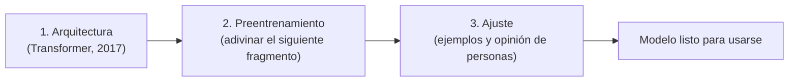

---
tags:
  - taller-ia
  - modulo-2
  - entrenamiento
modulo: 2
aliases:
  - De dónde viene un modelo de lenguaje
  - Preentrenamiento y ajuste
  - Reglas escritas y reglas aprendidas
---

> [!info] Qué resuelve esta nota
> Un modelo de lenguaje se construye en **tres etapas**: se diseña una arquitectura, se **preentrena** con muchísimo texto y se **ajusta** para que siga instrucciones. Entender qué hace cada etapa explica por qué el modelo sabe lo que sabe, por qué se equivoca como se equivoca y por qué no aprende nada nuevo mientras conversas contigo.

## 1. Arquitectura: el diseño

La **arquitectura** es la estructura del cálculo: qué operaciones se hacen y en qué orden. La que domina hoy es el **Transformer**, presentado en 2017 por un equipo de Google en el artículo «La atención es todo lo que necesitas» (*Attention Is All You Need*). Su propuesta: una red basada únicamente en mecanismos de **atención**, sin recurrencia ni convoluciones. Según los autores, es más paralelizable y requiere mucho menos tiempo de entrenamiento que los modelos de la época: 28.4 BLEU en traducción inglés-alemán y 41.0 BLEU en inglés-francés tras 3.5 días en ocho unidades de procesamiento gráfico (GPU) (BLEU es una medida de calidad de traducción). La atención se explica en [[06 Transformer y atención|Transformer y atención]].

## 2. Preentrenamiento: leer mucho y adivinar

En el preentrenamiento el modelo lee enormes cantidades de texto y aprende a **predecir el siguiente fragmento** (*token*). Según la explicación de Sebastian Raschka:

- **No hace falta etiquetar nada a mano.** El propio texto aporta la entrada y la respuesta correcta: se toma un trozo, se desplaza una posición y cada posición debe predecir el fragmento que sigue. A esto se le llama aprendizaje autosupervisado. Un trozo de cinco fragmentos, por ejemplo, ofrece cuatro objetivos de entrenamiento.
- **Todas las posiciones se puntúan en un solo paso.** Como el texto completo ya se conoce, el modelo puede calcular sus predicciones para todas las posiciones a la vez. Una «máscara» evita que cada posición vea los fragmentos posteriores.
- **Al generar, el proceso es secuencial.** Cuando se escribe una respuesta, la continuación aún no existe: se elige un fragmento, se agrega y se repite. Eso se ve en [[07 Predicción y azar|Predicción y azar]].

> [!warning] Lo que el preentrenamiento *no* garantiza
> Raschka lo dice explícitamente: el objetivo de predecir el siguiente fragmento **no da directamente etiquetas** de corrección factual, utilidad o seguimiento de instrucciones. Esas propiedades dependen de los datos, de la capacidad del modelo y de las etapas posteriores. Por eso un modelo preentrenado no es todavía un buen asistente, y por eso existen las [[10 Alucinaciones|Alucinaciones]].

## 3. Ajuste: aprender a seguir instrucciones

Después se vuelve a entrenar al modelo para que responda de forma útil. El artículo de **InstructGPT** (Ouyang et al., 2022) describe un procedimiento en dos pasos: primero, ajustar GPT-3 con ejemplos de comportamiento deseado escritos por personas; después, refinar con **aprendizaje por refuerzo a partir de retroalimentación humana**, usando clasificaciones que personas hicieron de varias respuestas del modelo.

El resultado fue que las personas evaluadoras preferían las respuestas de un InstructGPT de 1.3 mil millones de parámetros a las de un GPT-3 de 175 mil millones, con mejoras en veracidad y menos contenido tóxico. Los autores señalan que los modelos todavía cometen errores sencillos. La frase central del resumen: hacer los modelos más grandes **no los hace mejores, por sí solo, para seguir la intención del usuario**.

## Mientras conversas, el modelo no aprende nada nuevo

En el uso normal, lo que escribes entra al **contexto** de esa conversación (ver [[09 Ventana de contexto|Ventana de contexto]]) y el modelo no se reentrena en ese momento. Un caso documentado: GPT-3 hacía tareas nuevas a partir de ejemplos escritos en la instrucción **sin ninguna actualización de gradiente ni ajuste fino** (Brown et al., 2020). A eso se le llama *aprendizaje en contexto* y se retoma en [[18 Plantilla y recursos para escribir instrucciones|Plantilla y recursos para escribir instrucciones]].

¿Y la «memoria» de las aplicaciones? Depende de cada una y conviene leer su documentación:

- **Claude Code** documenta que cada sesión empieza con una ventana de contexto nueva y que sus archivos `CLAUDE.md` y su memoria automática se cargan al inicio y se tratan como **contexto**, no como configuración obligatoria (ver [[15 Contexto en documentos|Contexto en documentos]]).
- **ChatGPT** documenta que decide qué información disponible es relevante para una respuesta. Aparte, si la persona lo permite, OpenAI puede usar chats e información recordada para mejorar sus modelos; eso es un proceso de entrenamiento de la empresa, distinto de lo que ocurre dentro de una conversación.

## Reglas escritas y reglas aprendidas

NIST define un **algoritmo** como «un conjunto computable de pasos para lograr un resultado deseado». Un programa clásico codifica las reglas que escribió una persona. En un modelo de lenguaje, el **cálculo** (la arquitectura) es fijo y el **comportamiento** depende de los *pesos*, números que se obtienen en el entrenamiento a partir de datos (ver [[05 Pesos y parámetros|Pesos y parámetros]]).

| | Programa clásico | Modelo de IA |
| :--- | :--- | :--- |
| Quién define el comportamiento | Una persona, regla por regla | Los datos de entrenamiento, que fijan los pesos |
| Qué ocurre al usarlo | Entrada → reglas escritas → salida | Entrada → cálculo fijo con pesos → salida |
| Cuándo se «programa» | Al escribir el código | Durante el entrenamiento (una vez); cada consulta solo usa el resultado |

> [!example] Ejemplo
> Calcular el IVA de una factura es una **regla escrita**: el resultado es siempre el mismo para el mismo dato. Distinguir si una reseña de un restaurante es positiva o negativa es difícil de escribir como reglas («si dice "excelente" es positiva», pero «no estuvo excelente» no lo es); se aprende mejor de miles de reseñas ya clasificadas.

> [!note] Precisión sobre el azar
> No conviene decir que la IA «se distingue de un algoritmo por el azar». NIST incluye el **algoritmo aleatorizado** como un tipo de algoritmo. Lo que distingue a un modelo es que su comportamiento **se aprende de datos** en vez de escribirse como reglas. La IA tampoco se reduce a un algoritmo escrito a mano: incluye modelos entrenados, programas que los entrenan y programas que los ejecutan.

## Fuentes

- Vaswani et al., 2017, [*Attention Is All You Need*](https://arxiv.org/abs/1706.03762): resumen (arquitectura basada solo en atención; resultados de traducción).
- Raschka, [predicción del siguiente token](https://sebastianraschka.com/faq/docs/next-token-prediction.html): entrenamiento autosupervisado, puntuación paralela y generación secuencial, límites del preentrenamiento.
- Ouyang et al., 2022, [InstructGPT](https://arxiv.org/abs/2203.02155): ajuste con ejemplos humanos y retroalimentación humana.
- Brown et al., 2020, [*Language Models are Few-Shot Learners*](https://arxiv.org/abs/2005.14165): «sin actualizaciones de gradiente ni ajuste fino».
- Claude Code, [cómo Claude recuerda tu proyecto](https://code.claude.com/docs/en/memory) · OpenAI, [preguntas frecuentes de Memoria](https://help.openai.com/en/articles/8590148-memory-faq).
- NIST, [definición de algoritmo](https://xlinux.nist.gov/dads/HTML/algorithm.html).

## Siguiente

El texto no entra al modelo como letras: primero se parte en fragmentos. Continúa con [[04 Tokens e incrustaciones|Tokens e incrustaciones]].

← [[00 Módulo II - Índice]]
