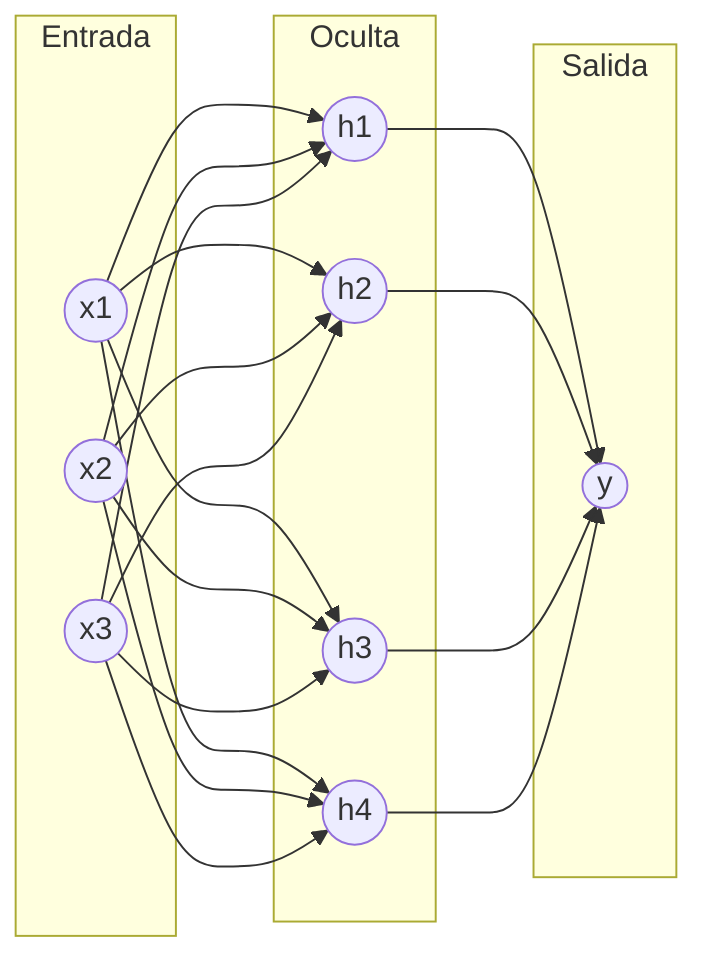

---
tags:
  - taller-ia
  - modulo-2
  - parametros
modulo: 2
aliases:
  - Pesos
  - Parámetros
  - Redes neuronales
---

> [!info] Qué resuelve esta nota
> «Pesos» y «parámetros» se mencionan todo el tiempo (modelos de pesos abiertos, «671 mil millones de parámetros»). Aquí se define cada término, se hace una cuenta a mano con una neurona y se aclaran tres confusiones frecuentes.

## La red neuronal en una imagen

Una **red neuronal** se organiza en capas de unidades llamadas **neuronas**: una capa de entrada, una o más **capas ocultas** y una capa de salida. Cada neurona recibe números de la capa anterior y envía un número a la siguiente.

## Peso, sesgo y parámetro

- **Peso.** Un número en cada conexión que indica cuánto influye una neurona en la siguiente. En un dibujo, una línea más gruesa significa más influencia.
- **Sesgo** (*bias*). Un número que cada neurona suma a su resultado.
- **Parámetros.** Todos los números ajustables del modelo: los pesos **y** los sesgos. En la práctica se usan a menudo como sinónimos; por ejemplo, OpenAI describe sus modelos gpt-oss como modelos «de pesos abiertos» de 117 y 21 mil millones de parámetros.

El curso intensivo de aprendizaje automático de Google (*Machine Learning Crash Course*) lo describe así: cada neurona calcula el valor de salida sumando el producto de cada una de sus entradas por su peso y añadiendo el sesgo; y «el número total de parámetros incluye tanto los parámetros de peso como los de sesgo».

### Cuenta a mano

> [!example] Ejemplo (números inventados)
> Una neurona recibe tres entradas, con sus pesos, y tiene un sesgo:
>
> | | Entrada 1 | Entrada 2 | Entrada 3 |
> | :--- | :-: | :-: | :-: |
> | Valor de la entrada | 1.0 | 2.0 | 3.0 |
> | Peso | 0.5 | −0.2 | 0.1 |
> | Producto | 0.5 | −0.4 | 0.3 |
>
> Suma de productos: 0.5 − 0.4 + 0.3 = 0.4. Se añade el sesgo de 0.3 → **0.7**.
>
> Si cambiaras el peso de la entrada 2 de −0.2 a 0.3, el producto sería 0.6 y el resultado cambiaría a 1.7: **ajustar un peso cambia la respuesta**, y eso es exactamente lo que se hace al entrenar. En una red real, el resultado pasa además por una función no lineal; el curso de Google subraya que sin cálculo no lineal la red no puede aprender relaciones no lineales.

### Cuántos parámetros tiene una red pequeña

El mismo curso de Google ofrece este ejemplo: una red con 3 entradas, una capa oculta de 4 neuronas y una salida.

| Capa | Cuenta | Parámetros |
| :--- | :--- | :-: |
| Oculta (4 neuronas) | cada neurona: 3 pesos + 1 sesgo = 4 | 16 |
| Salida (1 neurona) | 4 pesos + 1 sesgo = 5 | 5 |
| **Total** | | **21** |

## Cómo se ajustan: el entrenamiento

Rumelhart, Hinton y Williams (*Nature*, 1986) describen un procedimiento que **ajusta repetidamente los pesos de las conexiones** de la red para minimizar una medida de la diferencia entre la salida real y la deseada. Entrenar es hacer eso muchísimas veces, poco a poco. En un modelo de lenguaje, la «salida deseada» es el fragmento que realmente sigue en el texto (ver [[03 Cómo se construye un modelo|Cómo se construye un modelo]]).

> [!example] Analogía
> Los parámetros son como las **perillas de una consola de sonido**. Entrenar es girarlas poco a poco hasta que suena bien; un modelo entrenado es la consola con sus perillas ya ajustadas.

## Qué tamaño tienen

| Modelo | Parámetros | Fuente |
| :--- | :--- | :--- |
| GPT-3 (2020) | 175 mil millones | Brown et al. |
| gpt-oss (OpenAI, 2025) | 117 y 21 mil millones en total | OpenAI |
| DeepSeek-V3 | 671 mil millones en total; 37 mil millones activados por cada fragmento | DeepSeek |

DeepSeek-V3 se describe en su resumen como un modelo de «mezcla de expertos» (*Mixture-of-Experts*): tiene 671 mil millones de parámetros **en total**, pero para cada fragmento solo se activan 37 mil millones. Por eso conviene preguntar siempre «¿parámetros totales o activos?» al comparar tamaños. El resumen también reporta un preentrenamiento con 14.8 billones (*trillion*, 10¹²) de tokens.

## Tres confusiones frecuentes

1. **Pesos ≠ porcentajes de atención.** Los pesos del modelo se aprenden al entrenar y son los mismos para cualquier texto. Los porcentajes de atención se calculan de nuevo con cada texto (ver [[06 Transformer y atención|Transformer y atención]]).
2. **Pesos ≠ combinaciones de la red.** Los pesos son los números de las conexiones; las combinaciones ocurren cuando cada neurona suma sus entradas multiplicadas por esos pesos.
3. **«Ventana de parámetros» no es un término técnico.** Lo que sí existe es la **ventana de contexto**, que es otra cosa: cuánto texto puede considerar el modelo a la vez (ver [[09 Ventana de contexto|Ventana de contexto]]).

> [!note] Pesos abiertos
> Cuando una empresa «publica los pesos», publica estos números: con ellos, cualquiera puede ejecutar el modelo por su cuenta. Qué más se publica (código de entrenamiento, datos) distingue *pesos abiertos* de *código abierto*; se explica en [[11 Tipos de modelo|Tipos de modelo]].

## Fuentes

- Google, [*Machine Learning Crash Course*: nodos y capas ocultas](https://developers.google.com/machine-learning/crash-course/neural-networks/nodes-hidden-layers).
- Rumelhart, Hinton y Williams, [*Nature* (1986)](https://www.nature.com/articles/323533a0).
- Brown et al., 2020, [GPT-3](https://arxiv.org/abs/2005.14165) · OpenAI, [gpt-oss](https://openai.com/index/introducing-gpt-oss/) (5 de agosto de 2025) · [DeepSeek-V3](https://arxiv.org/abs/2412.19437).

## Siguiente

Con los números de la red claros, falta ver cómo el modelo decide qué palabras importan: [[06 Transformer y atención|Transformer y atención]].

← [[00 Módulo II - Índice]]
