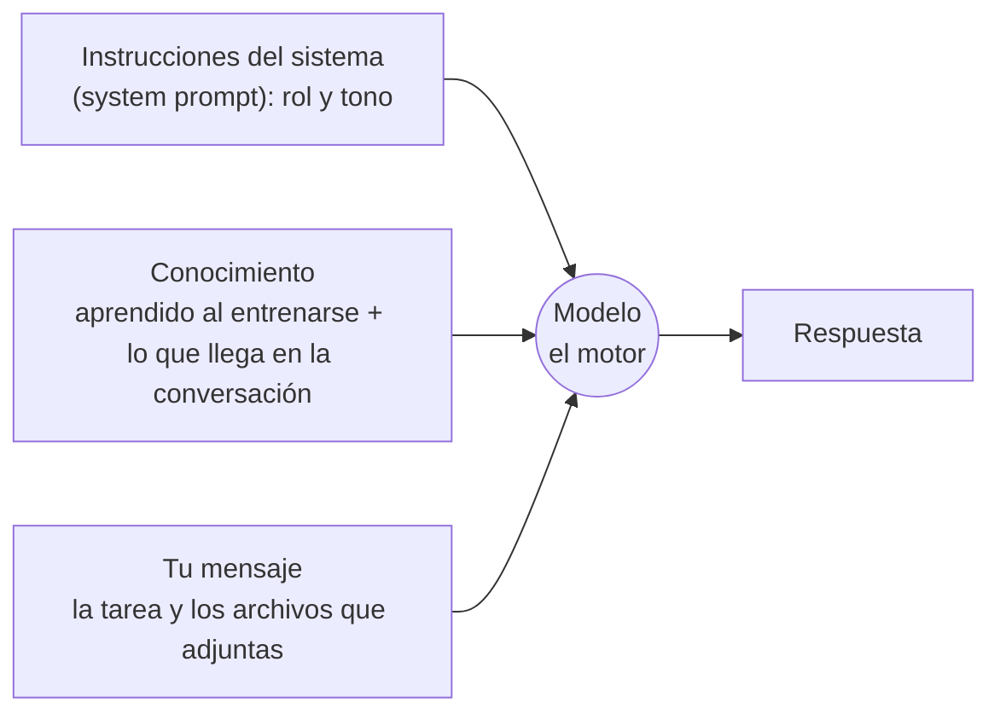

---
tags:
  - taller-ia
  - modulo-2
  - system-prompt
modulo: 2
aliases:
  - Motor, system prompt y conocimiento
  - System prompt
  - Instrucciones del sistema
---

> [!info] Qué resuelve esta nota
> Cuando el modelo responde, combina **lo que aprendió al entrenarse** con **todo lo que recibe en ese momento**. Esta nota separa esas piezas: el *motor* (el modelo), las *instrucciones del sistema* (*system prompt*), el *conocimiento* y *tu mensaje*. Saber qué entra por cada puerta te dice dónde poner cada cosa cuando escribas instrucciones.

## Las cuatro piezas

| Pieza | Qué es | Quién la controla |
| :--- | :--- | :--- |
| **Modelo (el motor)** | El sistema entrenado que calcula la respuesta; ver [[03 Cómo se construye un modelo|Cómo se construye un modelo]]. | La empresa que lo entrenó |
| **Instrucciones del sistema** (*system prompt*) | Texto que fija el rol, el tono y las reglas generales. | En la interfaz de programación (API), quien programa la llamada; en una aplicación, normalmente quien la construye |
| **Conocimiento** | Lo aprendido en el entrenamiento y lo que llega en la conversación (por ejemplo, archivos adjuntos). | El entrenamiento, y tú con lo que adjuntas |
| **Tu mensaje** | La tarea concreta y los archivos que adjuntas. | Tú |

## Las instrucciones del sistema (*system prompt*)

La documentación de la API de Claude lo define como **una forma de dar contexto e instrucciones al modelo, como especificar una meta o un rol concreto**, y lo pasa en un parámetro propio (`system`), distinto de los mensajes. La guía de buenas prácticas de Claude añade que **asignar un rol en las instrucciones del sistema enfoca el comportamiento y el tono del modelo; aun una sola frase marca la diferencia**.

Google sugiere un reparto parecido para Gemini: en la instrucción del sistema ponen las restricciones de comportamiento, la definición del rol (persona) y el formato de salida; en el mensaje de la persona, el contexto y la tarea.

> [!example] Ejemplo
> - *Instrucciones del sistema:* «Eres revisor de textos profesionales. Responde en español de México y con tono claro y formal.»
> - *Tu mensaje:* «Revisa el argumento del segundo párrafo del texto adjunto y dime qué evidencia falta.» + el archivo.
>
> El rol y el tono se mantienen aunque cambies de tema en la conversación; la tarea y el archivo cambian con cada mensaje.

## Qué cuenta como «conocimiento»

Hay dos fuentes y conviene no confundirlas:

1. **Lo aprendido al entrenarse** (ver [[05 Pesos y parámetros|Pesos y parámetros]]). No incluye tus documentos, a menos que estén públicos y hayan formado parte de los datos de entrenamiento, y no se puede dar por hecho que sea correcto ni actual (ver [[10 Alucinaciones|Alucinaciones]]).
2. **Lo que llega en la conversación**: archivos adjuntos, texto pegado, resultados de herramientas. Según la documentación de Claude, todo eso cuenta dentro de la **ventana de contexto** (ver [[09 Ventana de contexto|Ventana de contexto]]).

> [!tip] Consecuencia práctica
> Si necesitas que el modelo trabaje con *tu* información, entrégasela como contexto: adjunta el documento o pégalo. Lo que no le des, no puede usarlo. Más sobre cómo organizar ese contexto en [[15 Contexto en documentos|Contexto en documentos]].

> [!example] Ejemplo: con y sin contexto
> - Sin contexto: «¿Cuál es el argumento principal del artículo?» → el modelo no tiene el artículo; puede pedir que lo compartas o, peor, inventar una respuesta plausible.
> - Con contexto: «Con el artículo adjunto, resume el argumento principal en tres líneas y cita la página.» → el modelo trabaja con el texto que tiene delante.

## Qué sigue

Con esto se completa el mapa de lo que entra al modelo. Lo que cabe, y lo que ocurre cuando no cabe, es el tema de [[09 Ventana de contexto|Ventana de contexto]].

## Fuentes

- Claude API, [crear un mensaje](https://platform.claude.com/docs/en/api/messages/create): parámetro `system`.
- Claude, [buenas prácticas para escribir instrucciones (*prompting*)](https://platform.claude.com/docs/en/build-with-claude/prompt-engineering/claude-prompting-best-practices): asignar un rol en las instrucciones del sistema.
- Google, [estrategias para escribir instrucciones en Gemini (*prompting*)](https://ai.google.dev/gemini-api/docs/prompting-strategies): reparto entre instrucción del sistema y mensaje.
- Claude, [ventanas de contexto](https://platform.claude.com/docs/en/build-with-claude/context-windows).

← [[00 Módulo II - Índice]]
