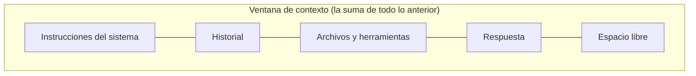

---
tags:
  - taller-ia
  - modulo-2
  - contexto
modulo: 2
aliases:
  - Ventana de contexto
  - Memoria de trabajo
  - Context rot
---

> [!info] Qué resuelve esta nota
> La **ventana de contexto** es todo el texto que el modelo puede considerar a la vez: su «memoria de trabajo». Es finita, **todo** cuenta dentro de ella y, aunque sea enorme, **más texto no siempre es mejor**. Aquí se explica qué cabe, qué pasa cuando no cabe y cómo cuidarla.

## Qué es y qué cuenta

La documentación de Claude la define como todo el texto al que el modelo puede hacer referencia al generar una respuesta, **incluida la propia respuesta**. La describe como una «memoria de trabajo», distinta de los datos con los que se entrenó el modelo.

Cuenta dentro de la ventana todo lo que viaja en la petición:

- las instrucciones del sistema (*system prompt*),
- todos los mensajes del historial, incluidos resultados de herramientas, imágenes y documentos,
- las definiciones de las herramientas,
- la **respuesta** que el modelo genera, incluido su razonamiento (ver [[11 Tipos de modelo|Tipos de modelo]]).

Un detalle fino: en Claude, los prefijos de petición guardados en caché (almacenamiento en caché de instrucciones, *prompt caching*) **siguen ocupando la ventana**; el caché cambia lo que pagas por esos tokens, no si cuentan.

## Tamaños actuales (a 8 de octubre de 2026)

| Modelos | Ventana de contexto | Fuente |
| :--- | :-: | :--- |
| Claude Fable 5.1, Opus 5.5, Sonnet 5.5 y Haiku 5.5 | 1 millón de tokens | Documentación de Claude |
| Otros modelos de Claude (por ejemplo, versiones anteriores) | 200 mil tokens | Documentación de Claude |
| Familia GPT-6 (Astra, Sol, Luna) | 1.05 millones de tokens | Documentación de OpenAI |

> [!example] Para dimensionar
> Con la regla de OpenAI para inglés (100 tokens ≈ 75 palabras), un millón de tokens equivale a unas 750 mil palabras en inglés. En español la relación cambia (ver [[04 Tokens e incrustaciones|Tokens e incrustaciones]]), así que usa un contador de tokens para saber cuánto cabe de *tu* documento.

> [!warning] Esta tabla caduca
> Las ventanas cambian con cada generación de modelos. Verifícalas en [Claude](https://platform.claude.com/docs/en/build-with-claude/context-windows) y [OpenAI](https://developers.openai.com/api/docs/models) antes de citarlas.

### Qué pasa si no cabe

Según la documentación de Claude, si la **entrada sola** ya excede la ventana, la interfaz de programación (API) devuelve un error (400, «prompt is too long», es decir, «la instrucción es demasiado larga») en todos los modelos. En los modelos recientes, si la generación llega al límite durante la respuesta, esta se detiene con un motivo de parada específico (`model_context_window_exceeded`). Para conversaciones largas, Claude ofrece una función de **compactación en el servidor** (en versión beta) que resume las partes más antiguas para poder continuar.

## Más texto no siempre es mejor

La documentación de Claude lo dice así: «a medida que crece el número de tokens, la precisión y la capacidad de recordar el contenido disminuyen», un fenómeno llamado deterioro del contexto (*context rot*), y añade que **cuidar qué hay en el contexto importa tanto como cuánto espacio hay disponible**.

Anthropic lo explica con la idea de un «presupuesto de atención»: el modelo lo gasta al procesar grandes volúmenes de contexto, y su capacidad de recordar con exactitud lo que hay en él disminuye cuando crece.

### Lo que midieron en investigación

Liu et al. (*Transactions of the ACL*, 2024), en «Perdidos en el medio» (*Lost in the Middle*), probaron modelos en dos tareas con contextos largos: preguntas sobre varios documentos y recuperación de pares clave-valor. Encontraron que el rendimiento suele ser **mayor cuando la información relevante está al inicio o al final** y **baja de forma importante cuando está en medio**, incluso en modelos diseñados para contextos largos.

> [!warning] Alcance del hallazgo
> El estudio usó tareas específicas y los modelos de su momento (2023-2024). No se debe generalizar a todos los modelos actuales ni a toda tarea. La gráfica de la presentación solo ilustra la tendencia, sin cifras.

## Cómo cuidar el contexto

Anthropic propone como principio de diseño usar **el conjunto más pequeño posible de tokens de alta señal**: dar la menor cantidad de información, pero la que de verdad ayuda. Para trabajos largos describe tres técnicas:

| Técnica | Qué hace | Ejemplo |
| :--- | :--- | :--- |
| **Resumir (compactación)** | Se toma una conversación cercana al límite, se resume y se continúa con el resumen en lugar del historial completo. | Pedir un resumen de decisiones y pendientes y empezar una conversación nueva con él. |
| **Guardar notas aparte** | El agente escribe notas persistentes fuera de la ventana de contexto y las consulta cuando las necesita. | Un archivo `NOTAS.md` con lo ya resuelto. Ver [[15 Contexto en documentos|Contexto en documentos]]. |
| **Repartir el trabajo con ayudantes** (subagentes) | Un ayudante trabaja una tarea enfocada con su propia ventana «limpia» y devuelve solo un resumen condensado (típicamente de 1,000 a 2,000 tokens). | Un ayudante lee 20 artículos y devuelve un párrafo por artículo. Ver [[14 Orquestación de agentes|Orquestación de agentes]]. |

Anthropic también menciona la **recuperación justo a tiempo**: en vez de cargar todo desde el inicio, conservar identificadores ligeros (rutas de archivo, consultas guardadas, enlaces) y cargar los datos solo cuando hacen falta.

### Hábitos concretos (guía de Claude)

- **Pon los documentos largos arriba y la pregunta al final.** La guía dice que la consulta al final puede mejorar la calidad de la respuesta hasta 30 % en pruebas, sobre todo con entradas complejas de varios documentos.
- **Pide que cite primero.** Para tareas con documentos largos, la guía recomienda pedir al modelo que cite las partes relevantes antes de realizar la tarea.

> [!tip] Consejo
> Una conversación = una tarea. Si cambias de tema, empieza otra; cada mensaje del historial sigue ocupando la ventana. Si arrastras un hilo muy largo, conviene resumirlo y continuar en uno nuevo.

## Fuentes

- Claude, [ventanas de contexto](https://platform.claude.com/docs/en/build-with-claude/context-windows) · OpenAI, [modelos](https://developers.openai.com/api/docs/models).
- Anthropic, [*Effective context engineering for AI agents*](https://www.anthropic.com/engineering/effective-context-engineering-for-ai-agents).
- Liu et al., [*Lost in the Middle* (TACL 2024)](https://aclanthology.org/2024.tacl-1.9/) · [arXiv 2307.03172](https://arxiv.org/abs/2307.03172).
- Claude, [buenas prácticas para escribir instrucciones (*prompting*)](https://platform.claude.com/docs/en/build-with-claude/prompt-engineering/claude-prompting-best-practices): contexto largo.
- OpenAI, [qué son los tokens](https://help.openai.com/en/articles/4936856-what-are-tokens-and-how-to-count-them): regla de 100 tokens ≈ 75 palabras (inglés).

## Siguiente

Una de las consecuencias del contexto limitado y del azar es que el modelo a veces afirma con seguridad algo falso: [[10 Alucinaciones|Alucinaciones]].

← [[00 Módulo II - Índice]]
