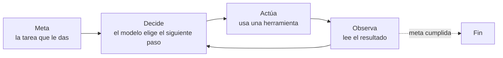

---
tags:
  - taller-ia
  - modulo-2
  - agentes
modulo: 2
aliases:
  - Chats vs agentes autónomos
  - Ciclo del agente
  - LLMs aislados vs agentes
---

> [!info] Qué resuelve esta nota
> La diferencia entre un **chat** y un **agente** no está en qué herramientas existen, sino en **quién conduce el proceso**: tú o el modelo. Esta nota define cada uno, recorre el ciclo del agente con un ejemplo paso a paso y explica por qué la autonomía tiene costos que conviene conocer antes de usarla.

> [!note] Sobre el nombre
> El temario habla de «modelos de lenguaje de gran tamaño (LLM) aislados frente a agentes autónomos». Aquí se usa **«chats»** porque comercialmente a esos modelos se les conoce así (ChatGPT, Claude o Gemini en modo conversación).

## Dos formas de trabajo

| | **Chat** | **Agente** |
| :--- | :--- | :--- |
| Quién conduce | **Tú**: escribes y el modelo responde, una vuelta a la vez | **El modelo**: recibes una meta y él decide los pasos |
| Qué hace con las herramientas | Trabaja con lo que escribes o adjuntas | Usa herramientas: leer archivos, buscar, ejecutar código |
| Qué hace con el resultado | Tú decides qué hacer con la respuesta y lo ejecutas | Revisa el resultado de cada paso antes de seguir |

La definición de Anthropic: un **agente** es un sistema donde el propio modelo **dirige dinámicamente su proceso y el uso de herramientas**, manteniendo el control sobre cómo cumple la tarea.

> [!warning] Dos errores frecuentes
> 1. **No es que un chat «no pueda» usar herramientas.** Muchas aplicaciones de chat incluyen búsqueda web, ejecución de código o lectura de archivos. Lo que distingue a un agente es que *el modelo decide* cuándo y cómo usarlas para cumplir una meta, con varios pasos encadenados.
> 2. **Un agente no es mejor ni infalible.** Es otra forma de trabajar, con ventajas y costos (ver más abajo).

## El ciclo de un agente

Según Anthropic, los agentes comienzan con una instrucción o una conversación con la persona; una vez clara la tarea, planean y operan con independencia, y **obtienen la «verdad del entorno» (*ground truth*) en cada paso**, es decir, los resultados reales de sus acciones, para evaluar su avance. Pueden detenerse para pedir retroalimentación humana en **puntos de control** o cuando encuentran bloqueos, y es común incluir **condiciones de parada**, como un número máximo de iteraciones.

El patrón de alternar razonamiento y acción tiene respaldo en investigación: **ReAct** (Yao et al., 2022) propone que el modelo genere razonamientos y acciones de forma intercalada. El razonamiento ayuda a seguir planes y manejar excepciones, y las acciones le permiten consultar fuentes externas. Los autores reportan que, en dos pruebas interactivas (ALFWorld y WebShop) y con solo uno o dos ejemplos en la instrucción, ReAct superó a métodos de imitación y de aprendizaje por refuerzo por 34 y 10 puntos porcentuales absolutos, respectivamente.

## Ejemplo: ordenar la bibliografía de un informe

> [!example] Ejemplo (la misma tarea en las dos formas de trabajo)
> **Situación:** un informe sobre trabajo híbrido y 4 artículos en PDF guardados en una carpeta. Meta: una bibliografía ordenada.
>
> **Como chat** (tú conduces):
>
> | Quién | Paso |
> | :--- | :--- |
> | Tú | Abres el artículo 1 y copias sus datos |
> | Tú → modelo | Pegas los datos y pides la ficha bibliográfica |
> | Modelo → tú | Devuelve «Ficha 1» |
> | Tú | Copias la ficha, pegas el artículo 2… y repites con el 3 y el 4 |
> | Tú | Reúnes las cuatro fichas y las ordenas |
>
> **Como agente** (el modelo conduce):
>
> | Quién | Paso |
> | :--- | :--- |
> | Tú | Entregas la meta: «ordena la bibliografía de mi informe» |
> | Modelo (actúa) | Lista los archivos de la carpeta |
> | Modelo (actúa) | Abre los artículos uno por uno |
> | Modelo (observa) | «Al artículo 3 le falta el año» |
> | Modelo (decide) | Dos caminos: buscar el dato o dejarlo vacío y avisar; elige buscarlo |
> | Modelo (actúa) | Usa la búsqueda en internet y encuentra el año |
> | Modelo (actúa) | Escribe el archivo con la bibliografía |
> | Modelo (observa) | Compara fichas con artículos: 4 fichas, 4 artículos |
> | Tú | Revisas el resultado final |
>
> En el chat, **las decisiones intermedias son tuyas**; en el agente, son del modelo y tú revisas al final (o en los puntos de control que hayas definido). El ejemplo es inventado; no sugiere que uno ahorre tiempo respecto al otro.

## Lo que cuesta la autonomía

Anthropic advierte que **la naturaleza autónoma de los agentes implica mayores costos y la posibilidad de errores que se acumulan**. Por eso recomienda:

- **Probar a fondo en entornos aislados** (*sandbox*), con las salvaguardas adecuadas (*guardrails*).
- **Puntos de revisión humana**: que el agente pueda pausar para pedir tu retroalimentación.
- **Empezar simple:** buscar la solución más sencilla posible y aumentar la complejidad solo cuando haga falta. Para muchas aplicaciones, según Anthropic, basta optimizar una sola llamada al modelo con recuperación de información y ejemplos.

Sobre el costo en texto procesado, en su sistema de investigación multiagente Anthropic reporta, **en sus datos**, que los agentes usan típicamente unas 4 veces más tokens que una conversación de chat y los sistemas multiagente unas 15 veces más. Son cifras de un caso concreto, no una regla general.

> [!tip] Consejo
> Antes de delegar una tarea a un agente, pregúntate: ¿qué pasa si se equivoca en el paso 3 y sigue hasta el 10? ¿Puedo revisar el resultado? ¿El entorno donde actúa es seguro (archivos de prueba, sin acceso a lo que no debe tocar)? Los permisos y las decisiones que requieren intervención humana se trabajan en el Módulo III.

## Fuentes

- Anthropic, [*Building effective agents*](https://www.anthropic.com/research/building-effective-agents): definición, sección «Agents», recomendaciones de pruebas y puntos de control.
- Anthropic, [*How we built our multi-agent research system*](https://www.anthropic.com/engineering/multi-agent-research-system): cifras de 4× y 15×.
- Yao et al., 2022, [ReAct](https://arxiv.org/abs/2210.03629).

## Siguiente

Cómo se combinan varios modelos y agentes: [[14 Orquestación de agentes|Orquestación de agentes]]. Para comparar modelos con rigor: [[13 Pruebas de referencia|Pruebas de referencia]].

← [[00 Módulo II - Índice]]
