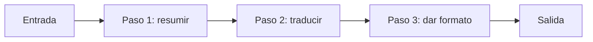
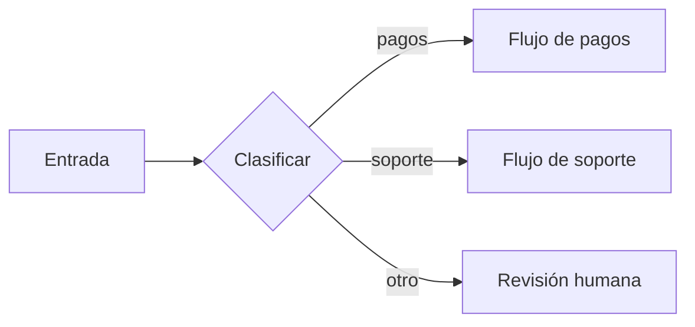
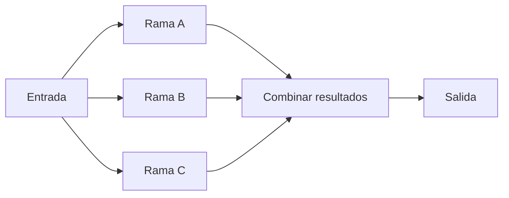
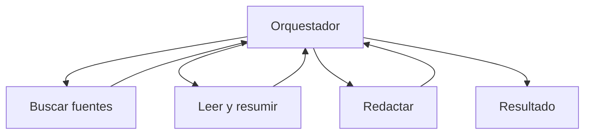
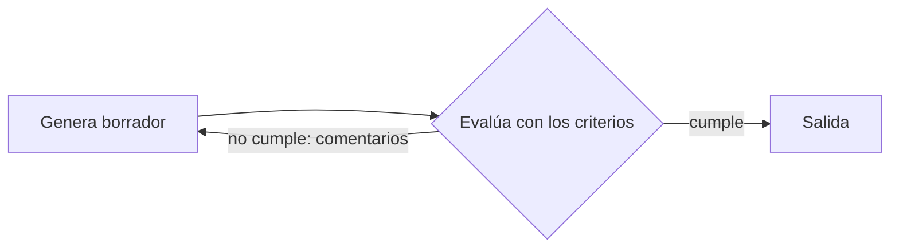

---
tags:
  - taller-ia
  - modulo-2
  - agentes
  - orquestacion
modulo: 2
aliases:
  - Orquestación
  - Multiagente
  - Orquestador y trabajadores
  - Patrones de agentes
---

> [!info] Qué resuelve esta nota
> **Orquestar** es combinar varios pasos, modelos o agentes para resolver una tarea. Esta nota explica la diferencia entre un *flujo de trabajo* y un *agente*, las **cinco formas de organizar el trabajo** que describe Anthropic, cómo funciona un sistema con un **agente coordinador y varios ayudantes**, y qué se complica al coordinar. Parte de [[12 Chat y agente|Chat y agente]].

## Flujo de trabajo o agente: quién define los pasos

Anthropic distingue dos cosas:

- **Flujo de trabajo** (*workflow*): el modelo y las herramientas se orquestan mediante **caminos definidos de antemano por código**.
- **Agente**: el modelo **decide sus propios pasos** y qué herramientas usar.

> [!example] Ejemplo
> - *Flujo de trabajo:* cada correo que llega se clasifica, se resume y se archiva, **siempre en ese orden**. El código define la secuencia; el modelo hace cada paso.
> - *Agente:* se le pide «ordena la bibliografía de mi informe» y **él decide** qué buscar, qué abrir y cómo organizarla.

Según Anthropic, los flujos de trabajo ofrecen **predictibilidad y consistencia** en tareas bien definidas; los agentes son mejores cuando se necesita flexibilidad y decisiones guiadas por el modelo a gran escala. Su recomendación: **buscar la solución más simple posible y aumentar la complejidad solo cuando haga falta.** Para muchas aplicaciones, basta una sola llamada bien optimizada, con recuperación de información y ejemplos en la instrucción. También sugiere a quien desarrolla empezar usando directamente las interfaces de programación (API) de los modelos antes que marcos de trabajo complejos.

La pieza básica de todos estos sistemas es un modelo «aumentado» con **recuperación de información, herramientas y memoria** (Anthropic).

## Cinco formas de organizar el trabajo

Anthropic describe cinco patrones comunes de flujo de trabajo. A continuación, un resumen de sus descripciones.

### 1. Encadenar pasos (*prompt chaining*)

**Qué hace.** Descompone la tarea en una secuencia de pasos; cada paso procesa la salida del anterior.
**Cuándo sirve.** Cuando la tarea se puede dividir limpiamente en subtareas fijas; se intercambia algo de tiempo (latencia) por mayor precisión.
**Ejemplo de Anthropic:** generar un texto publicitario y luego traducirlo. **Ejemplo:** resumir, luego traducir y luego dar formato.



### 2. Enrutar (*routing*)

**Qué hace.** Clasifica la entrada y la dirige a una tarea especializada.
**Cuándo sirve.** Cuando hay categorías distintas que se atienden mejor por separado.
**Ejemplos de Anthropic:** dirigir consultas de servicio al cliente a procesos diferentes; enviar las preguntas fáciles a modelos más pequeños. **Ejemplo:** una duda de pagos va a un flujo; una de soporte, a otro.



### 3. Paralelizar (*parallelization*)

**Qué hace.** Varios modelos trabajan a la vez y sus resultados se combinan. Tiene dos variantes: **seccionar** (dividir en subtareas independientes que corren en paralelo) y **votar** (ejecutar la misma tarea varias veces para obtener resultados diversos).
**Cuándo sirve.** Según Anthropic, cuando las subtareas se pueden paralelizar por velocidad, o cuando se necesitan **varias perspectivas o intentos para obtener resultados con mayor confianza**.
**Ejemplos de Anthropic:** un modelo atiende la consulta mientras otro la revisa por contenido inapropiado (seccionar); varias instrucciones revisan un código en busca de vulnerabilidades y señalan problemas (votar). **Ejemplo:** revisar al mismo tiempo cinco capítulos de un informe.



### 4. Orquestador y trabajadores (*orchestrator-workers*)

**Qué hace.** Un modelo central **descompone las tareas dinámicamente, las delega a modelos trabajadores y sintetiza sus resultados**.
**Cuándo sirve.** Cuando no se pueden prever las subtareas necesarias; por ejemplo, un producto de programación que debe modificar varios archivos según la entrada. La diferencia con paralelizar es esa: **aquí las subtareas no están definidas de antemano**, las decide el orquestador.
**Ejemplo:** investigar un tema con varias fuentes a la vez.



### 5. Evaluador y optimizador (*evaluator-optimizer*)

**Qué hace.** Una llamada al modelo **genera** una respuesta y otra **la evalúa y da retroalimentación**, en un ciclo.
**Cuándo sirve.** Es especialmente eficaz cuando hay **criterios de evaluación claros**. Anthropic menciona dos señales de buen ajuste: que las respuestas del modelo mejoren de forma demostrable cuando una persona da su retroalimentación y que el modelo pueda dar esa retroalimentación.
**Ejemplo de Anthropic:** traducción literaria con un evaluador que critica. **Ejemplo:** un borrador y un revisor que lo mejora hasta cumplir los criterios.



> [!tip] Conexión con el Módulo II
> Fíjate que el evaluador funciona **bien solo si hay criterios claros**: es la misma idea de los *criterios de aceptación* de [[17 Anatomía de una instrucción|Anatomía de una instrucción]]. Sin criterios que se puedan comprobar, un revisor automático no tiene contra qué evaluar.

## Orquestador y trabajadores en un sistema real

Anthropic describe su sistema de investigación multiagente así: **un agente líder coordina el proceso y delega en subagentes especializados que trabajan en paralelo**. Cada subagente explora una faceta del tema con **su propia ventana de contexto**, filtra la información con herramientas de búsqueda y devuelve un resumen. Después, el líder sintetiza y, en su diseño, un agente adicional se encarga de las citas.

### Por qué ayuda separar

Anthropic lo resume como **separación de responsabilidades**: herramientas, instrucciones y trayectorias de exploración distintas por subagente, y ventanas de contexto paralelas. Esto conecta con el cuidado del contexto de [[09 Ventana de contexto|Ventana de contexto]]: un ayudante puede leer mucho y devolver solo un resumen corto (típicamente de 1,000 a 2,000 tokens), manteniendo limpia la ventana del agente principal.

### Cómo instruir a los ayudantes

Anthropic aprendió que el agente líder debe enseñarse a delegar: **cada subagente necesita un objetivo, un formato de salida, orientación sobre las herramientas y fuentes que debe usar y límites claros de la tarea.** Con descripciones vagas como «investiga la escasez de semiconductores», los subagentes duplicaron trabajo: en uno de sus ejemplos, dos de ellos investigaron las mismas cadenas de suministro de 2025 en lugar de repartirse el trabajo.

> [!example] Ejemplo: delegar bien y mal
> - *Vago:* «Investiga el tema.»
> - *Con las cuatro piezas de Anthropic:*
>   - **Objetivo:** encontrar tres artículos académicos de 2020 en adelante sobre trabajo híbrido.
>   - **Formato de salida:** una ficha por artículo (autor, año, argumento principal, enlace).
>   - **Herramientas y fuentes:** solo buscadores académicos; no blogs.
>   - **Límites:** no resumir artículos de otros temas; máximo 10 búsquedas.

También recomienda **escalar el esfuerzo a la complejidad**: según sus pautas, una búsqueda simple de un dato requiere solo 1 agente con 3 a 10 llamadas a herramientas. Y para evitar que la información se deforme al pasar de agente en agente (el «teléfono descompuesto»), sugieren que los subagentes **guarden su trabajo en archivos y pasen al coordinador solo una referencia ligera**.

### Claude Code: ayudantes que se definen en un archivo

En Claude Code, un **subagente** es un asistente especializado que corre **en su propia ventana de contexto, con una instrucción de sistema propia, acceso específico a herramientas y permisos independientes**; trabaja de forma autónoma y devuelve solo el resumen. La documentación enumera beneficios: preservar el contexto, imponer restricciones limitando herramientas, reutilizar configuraciones, especializar el comportamiento y controlar costos usando modelos más rápidos. Se define con un archivo Markdown con encabezado YAML; solo `name` y `description` son obligatorios.

```markdown
---
name: revisor-bibliografia
description: Revisa que las fichas bibliográficas estén completas
tools: Read, Glob, Grep
model: sonnet
---

Eres un revisor de bibliografías. Revisa que cada ficha tenga autor, año y título,
e indica cuáles faltan. No modifiques archivos.
```

## Roles y perspectivas distintas para un mismo caso

Un uso frecuente de varios agentes es **examinar la misma situación desde ángulos diferentes**: a cada agente se le asigna un rol (por ejemplo, evaluar una decisión desde las finanzas, el cliente o los riesgos) y un coordinador compara las respuestas. Esto es lo que dicen las fuentes:

- **Un rol es una instrucción.** La guía de Claude indica que asignar un rol en las instrucciones del sistema (*system prompt*) enfoca el comportamiento y el tono del modelo (ver [[08 Qué recibe el modelo|Qué recibe el modelo]]). Los subagentes de Claude Code se definen con instrucciones propias, es decir, con roles propios.
- **Varias perspectivas o intentos pueden dar más confianza** en ciertos casos: es la variante de *votar* del patrón de paralelización, según Anthropic.
- **Debate entre instancias.** Du et al. (2023) proponen que varias instancias de un modelo **propongan y debatan sus respuestas y razonamientos durante varias rondas**; reportan mejoras en razonamiento matemático y estratégico y en la validez factual del contenido, aplicables a modelos de «caja negra».

> [!warning] Un rol no es una opinión
> Un rol es una instrucción que se le da a un agente, no un punto de vista propio. Asignar roles distintos sirve para *mirar un caso desde varios ángulos*, pero no garantiza mejores resultados: revisa las respuestas con tus propios criterios y toma tú la decisión final.

> [!example] Ejemplo: tres roles para una pregunta
> Pregunta: «¿Conviene lanzar un servicio nuevo?» Se entrega la misma pregunta a tres agentes con rol distinto:
>
> | Rol (instrucción) | Pregunta que guía su evaluación |
> | :--- | :--- |
> | Finanzas | ¿Cuánto cuesta y cuánto podría dejar? |
> | Cliente | ¿Le sirve a quien lo compraría? |
> | Riesgos | ¿Qué puede salir mal? |
>
> El coordinador reúne las tres respuestas en una comparación con dos zonas, «coinciden» y «difieren». **La decisión final la tomas tú.**

## Lo que se complica al coordinar

- **Cuesta más.** En los datos de Anthropic, los sistemas multiagente usan unas 15 veces más tokens que un chat (y los agentes individuales, unas 4 veces más). Por eso este tipo de sistemas solo se justifica cuando el valor de la tarea es lo bastante alto para pagar el mayor rendimiento. Ese artículo también reporta que, en su evaluación interna de investigación, el sistema con un agente líder y subagentes superó en 90.2 % a un agente individual (Claude Opus 4). Es un resultado de un caso concreto.
- **No todas las tareas se prestan.** Anthropic señala que los dominios que exigen contexto compartido o tienen muchas dependencias entre agentes **no son un buen ajuste hoy**; por ejemplo, la mayoría de las tareas de programación tienen menos partes realmente paralelizables que la investigación. También reconoce que los modelos actuales aún no son excelentes para coordinar y delegar a otros agentes en tiempo real.
- **Los errores se acumulan y los resultados varían.** Los agentes mantienen estado, los errores se acumulan, y sus decisiones son dinámicas y no deterministas entre ejecuciones, incluso con las mismas instrucciones, lo que dificulta depurar.
- **Instrucciones vagas = trabajo duplicado.** Ver arriba.

> [!tip] Consejo
> Antes de usar varios agentes, intenta resolver la tarea con una sola instrucción bien escrita (ver [[18 Plantilla y recursos para escribir instrucciones|Plantilla y recursos para escribir instrucciones]]). Si la tarea tiene partes independientes o necesita revisión por criterios, entonces considera paralelizar o un evaluador. Aumenta la complejidad solo si lo simple no alcanzó.

## Fuentes

- Anthropic, [*Building effective agents*](https://www.anthropic.com/research/building-effective-agents): flujo de trabajo y agente, los cinco patrones y cuándo usarlos.
- Anthropic, [*How we built our multi-agent research system*](https://www.anthropic.com/engineering/multi-agent-research-system): agente líder y subagentes, instrucciones de delegación, cifras de 4×, 15× y 90.2 %, límites, teléfono descompuesto.
- Anthropic, [*Effective context engineering for AI agents*](https://www.anthropic.com/engineering/effective-context-engineering-for-ai-agents): subagentes con resúmenes de 1,000 a 2,000 tokens.
- Claude Code, [subagentes](https://code.claude.com/docs/en/sub-agents).
- Claude, [buenas prácticas para escribir instrucciones (*prompting*)](https://platform.claude.com/docs/en/build-with-claude/prompt-engineering/claude-prompting-best-practices): rol en las instrucciones del sistema.
- Du et al., 2023, [*Improving Factuality and Reasoning in Language Models through Multiagent Debate*](https://arxiv.org/abs/2305.14325).

## Siguiente

Lo que escribas una vez en un archivo no hay que repetirlo en cada conversación: [[15 Contexto en documentos|Contexto en documentos]].

← [[00 Módulo II - Índice]]
