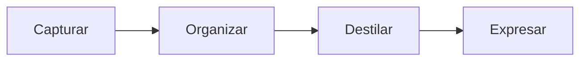

---
tags:
  - taller-ia
  - modulo-2
  - contexto
  - organizacion
  - para
modulo: 2
aliases:
  - Second Brain y PARA
  - Second Brain
  - Segundo cerebro
  - Building a Second Brain
  - PARA
  - CODE
---

> [!info] Qué resuelve esta nota
> [[15 Contexto en documentos|Contexto en documentos]] explicó **qué** poner en archivos para que un agente los lea. Esta nota trata de **cómo ordenar** esos archivos (y tus apuntes en general) para encontrarlos y reutilizarlos. Presenta una metodología conocida, «Construir un segundo cerebro» (*Building a Second Brain*) de Tiago Forte, y su sistema de carpetas **PARA**. No es la única forma de organizar conocimiento, pero sí de las más conocidas.

## Qué es un «segundo cerebro»

Tiago Forte lo define como *«un repositorio digital, externo y centralizado, para lo que aprendes»* y presenta *Building a Second Brain* como una metodología para **guardar y recordar sistemáticamente** las ideas. Se apoya en un proceso de cuatro pasos, **CODE** (por las iniciales en inglés de *Capture, Organize, Distill, Express*: capturar, organizar, destilar y expresar).

> [!note] Sobre la popularidad
> Según el sitio oficial del método, tiene más de 25 mil estudiantes en línea y un libro superventas (cifras del propio autor).

## Los cuatro pasos: CODE

El sitio oficial del método los describe así:

| Paso | Qué es | Pregunta práctica |
| :--- | :--- | :--- |
| **C**apturar (*Capture*) | Capturar información del mundo exterior | ¿Qué vale la pena guardar? |
| **O**rganizar (*Organize*) | Organizarla de modo que sea fácil encontrarla y usarla | ¿Dónde la pongo para encontrarla cuando la necesite? |
| **D**estilar (*Distill*) | Reducirla a las mejores ideas | ¿Cuál es la esencia? |
| **E**xpresar (*Express*) | Expresar tus ideas con tu propia voz: escribiendo, hablando, diseñando o enseñando | ¿Qué hago con esto? |

En el artículo de presentación, Forte titula cada paso con una recomendación: capturar **solo lo más importante**, organizar **para la acción**, destilar **hasta lo esencial** y expresar **tus ideas y experiencias únicas**.



> [!example] Ejemplo: CODE con un informe de trabajo
> - **Capturar:** guardas un artículo y tus apuntes de una reunión.
> - **Organizar:** los pones en la carpeta del informe que estás escribiendo.
> - **Destilar:** resumes en cinco líneas la idea principal y por qué importa.
> - **Expresar:** usas ese resumen en una presentación o en una sección del informe.

## PARA: cuatro carpetas por «utilidad para la acción»

Dentro del paso *Organizar*, Forte propone **PARA**. Según su artículo, el mejor criterio para organizar notas es **centrarse en los proyectos activos** y ordenar la información **por su utilidad para la acción** (*actionability*), no por tema general. PARA se describe como un sistema para organizar **cualquier información digital en cualquier plataforma**: el explorador de archivos, la nube o una aplicación de notas.

| Carpeta | Definición de Forte | Ejemplos de Forte |
| :--- | :--- | :--- |
| **P**royectos | Esfuerzos de corto plazo, en el trabajo o en la vida personal, con una meta concreta | Completar el diseño de una página web; comprar una computadora; remodelar el baño |
| **Á**reas | Partes importantes de tu trabajo y vida que **requieren atención continua** | Marketing, Recursos Humanos, Salud, Finanzas, Hijos |
| **R**ecursos | Temas que te interesan y sobre los que estás aprendiendo | Diseño gráfico, jardinería orgánica, fotografía |
| **A**rchivo | Cualquier cosa de las tres anteriores que **ya no está activa** pero quizá quieras conservar | Proyectos terminados o en pausa, áreas inactivas, recursos que ya no te interesan |

### La diferencia clave: proyecto vs. área

Un **proyecto** tiene un final: se termina. Un **área** no: se mantiene. Es la confusión más común.

> [!example] Ejemplo
> | Es un proyecto (se acaba) | Es un área (se mantiene) |
> | :--- | :--- |
> | Entregar el informe de fin de año | Salud |
> | Preparar la declaración anual | Finanzas personales |
> | Organizar una mudanza de oficina | Relación con clientes |

Cuando un proyecto termina, **pasa al Archivo**; lo que aprendiste puede quedar como recurso.

### Cómo se ve en carpetas

Ejemplo de estructura:

```text
Mi-segundo-cerebro/
├─ 1-Proyectos/
│  └─ Informe-trabajo-hibrido/
│     ├─ instrucciones.md
│     ├─ contexto.md
│     ├─ fuentes/
│     └─ notas/
├─ 2-Areas/
│  ├─ Salud/
│  └─ Finanzas-personales/
├─ 3-Recursos/
│  ├─ Inteligencia-artificial/
│  └─ Gestion-de-proyectos/
└─ 4-Archivo/
   └─ Informe-anterior/
```

Los números al inicio de los nombres hacen que las carpetas aparezcan en ese orden.

## Cómo se conecta con trabajar con agentes

Una forma práctica de combinarlo con agentes: **cada proyecto lleva su propio documento de instrucciones y de contexto**, como los de [[15 Contexto en documentos|Contexto en documentos]]. El agente que trabaja en el informe lee la carpeta de ese informe y no necesita cargar tus finanzas ni tus otros proyectos.

Esto se alinea con un principio que sí tiene respaldo en Anthropic: dar al modelo **el conjunto más pequeño posible de información de alta señal** y dejar que el agente cargue lo demás **solo cuando lo necesite**, apoyándose en la jerarquía de carpetas y los nombres de archivo como señales (ver [[09 Ventana de contexto|Ventana de contexto]]). Una organización por proyectos es una forma natural de lograrlo.

Un documento de contexto bien armado suele responder cuatro cosas:

```markdown
# Informe sobre trabajo híbrido

## Objetivo
Entregar un informe de 8 páginas.

## Audiencia
La dirección de la organización.

## Reglas
- Citar solo lo que está en fuentes/
- Español de México

## Archivos
- fuentes/articulo.pdf
```

| Sección | Responde |
| :--- | :--- |
| Objetivo | Qué se quiere lograr |
| Audiencia | Para quién es el resultado |
| Reglas | Qué debe y qué no debe hacer |
| Archivos | Dónde está la información |

## Y esta bóveda

Esta bóveda de Obsidian está organizada por **módulos del taller** (`Contenido/`, `presentaciones/`, `recursos/`), que es una organización de curso, no de PARA. Para **tu propia bóveda personal** puedes usar PARA, otro método o una mezcla; lo importante es que el criterio sea consistente y que puedas decir en una frase **dónde va cada nota nueva**.

> [!tip] Para decidir dónde va una nota
> Hazte una pregunta en este orden: *¿pertenece a un proyecto en el que trabajo ahora?* → Proyectos. *¿Es parte de algo que debo mantener siempre?* → Áreas. *¿Es un tema que quiero consultar luego?* → Recursos. *¿Ya no la uso?* → Archivo. Si dudas entre dos, elige la más cercana a la acción.

## Límites

- PARA organiza **dónde** va la información; no decide **qué** vale la pena guardar ni la convierte en comprensión. Eso es lo que hacen los pasos de destilar y expresar.
- PARA es una propuesta de un autor, no un estándar: otros métodos de organización son igualmente válidos.
- Un sistema complicado que no mantienes sirve menos que uno simple que sí usas.

## Fuentes

- Tiago Forte, [*The PARA Method*](https://fortelabs.com/blog/para/) (Forte Labs): definiciones y ejemplos de Proyectos, Áreas, Recursos y Archivo; organización por utilidad para la acción.
- Tiago Forte, [*Building a Second Brain: An Overview*](https://fortelabs.com/blog/basboverview/) (Forte Labs): definición de segundo cerebro, CODE y el criterio de organizar por proyectos activos.
- [Building a Second Brain](https://www.buildingasecondbrain.com/): descripción de los cuatro pasos de CODE; cifras de popularidad (del autor).
- Anthropic, [*Effective context engineering for AI agents*](https://www.anthropic.com/engineering/effective-context-engineering-for-ai-agents): conjunto mínimo de información de alta señal y señales en la jerarquía de carpetas.

## Siguiente

Pasamos a escribir instrucciones: [[17 Anatomía de una instrucción|Anatomía de una instrucción]].

← [[00 Módulo II - Índice]]
