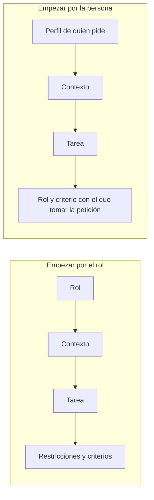

---
tags:
  - taller-ia
  - modulo-2
  - instrucciones
  - prompting
modulo: 2
aliases:
  - Instrucciones
  - Prompt
  - Qué debe incluir una instrucción
  - Criterios de aceptación
  - Orden de una instrucción
---

> [!info] Qué resuelve esta nota
> Todo lo anterior del módulo desemboca aquí: el modelo solo trabaja con lo que le llega ([[08 Qué recibe el modelo|Qué recibe el modelo]]) y con lo que cabe en su ventana ([[09 Ventana de contexto|Ventana de contexto]]). Una **instrucción** (o *prompt*) es la parte que escribes tú. Esta nota explica **qué debe contener**, **cómo saber si está bien escrita** y **en qué orden se puede acomodar**. La plantilla y los recursos están en [[18 Plantilla y recursos para escribir instrucciones|Plantilla y recursos para escribir instrucciones]].

## Cuatro preguntas que toda instrucción responde

Una instrucción completa responde cuatro preguntas. Estos cuatro elementos no tienen un orden fijo. La guía de Claude respalda la idea de fondo: ser claro, explícito y dar contexto.

| # | Elemento | Pregunta | En la práctica |
| :-: | :--- | :--- | :--- |
| 1 | **Tarea** | ¿Qué quieres que haga? | Un verbo y un resultado: *resume, compara, redacta* |
| 2 | **Información disponible** | ¿Con qué cuenta? | Los documentos y datos que le das. **Lo que no le des, no lo sabe** |
| 3 | **Restricciones** | ¿Qué límites tiene? | Formato, extensión, tono, fuentes y lo que no debe hacer |
| 4 | **Criterios de aceptación** | ¿Cómo sabrás que está bien? | Condiciones que puedas comprobar al revisar el resultado |

La segunda fila conecta con lo que vimos: el modelo no tiene acceso a tu documento, a tu situación ni a lo que dijiste ayer, salvo lo que esté en el contexto. La guía de Claude lo plantea con una imagen: pensar en Claude como **un colega brillante pero nuevo, que no conoce tus normas ni tus flujos de trabajo**.

### Los mismos cuatro elementos en distintos oficios

La estructura no depende de la profesión. Ejemplos de cómo se llenan:

| Perfil | Tarea | Información | Restricciones | Criterio de aceptación |
| :--- | :--- | :--- | :--- | :--- |
| Estudiante | Resumir una lectura | El capítulo en PDF y la pregunta del curso | 150 palabras; sin datos ajenos al texto | Incluye la tesis y un ejemplo del autor |
| Derecho | Señalar cláusulas ambiguas de un contrato | El contrato en PDF y el tipo de operación | Solo señalar, sin reescribir; citar la cláusula | Cada hallazgo indica el número de cláusula y por qué es ambigua |
| Contaduría | Detectar cifras que no cuadran entre dos reportes | Los dos reportes en hoja de cálculo | Resultado en tabla; no modificar los archivos | Cada diferencia trae importe, fila y posible causa |
| Docencia | Preparar una actividad de 20 minutos | Tema, nivel del grupo y materiales disponibles | Sin equipo especial; instrucciones redactadas para el grupo | Objetivo medible y forma de evaluarlo |

## La prueba del colega

La guía de Claude propone una regla práctica, que llama «regla de oro»:

> *Muestra tu instrucción a un colega con poco contexto sobre la tarea y pídele que la siga. Si a esa persona le confundiría, a Claude también.*

> [!example] Ejemplo: aplicar la prueba
> «Resume este artículo.» Un colega nuevo preguntaría: ¿para quién?, ¿cuánto debe medir?, ¿qué me interesa destacar?, ¿en qué idioma? Cada pregunta que se haría esa persona es una pieza que **falta en la instrucción**. Es lo que ocurre con el modelo, solo que él **no pregunta**: elige una interpretación y responde.

## Antes y después

Ejemplo de la misma tarea escrita de dos maneras.

**Versión vaga**

```text
Resume este artículo.
```

**Con los cuatro elementos**

```text
Tarea: Resume el artículo adjunto para un compañero que no lo ha leído.

Información: El artículo en PDF. Mi informe trata de trabajo híbrido.

Restricciones: Un párrafo de 120 palabras. No agregues datos que no estén
en el texto. Español de México.

Criterios de aceptación: Incluye el argumento principal, el método y una
limitación. Si algo no aparece, escribe «no aparece en el texto».
```

Qué cambió, elemento por elemento:

| Elemento | Qué aporta aquí | Qué evita |
| :--- | :--- | :--- |
| Tarea | «Para un compañero que no lo ha leído» fija el lector | Un resumen escrito para nadie en particular |
| Información | El enfoque del informe | Resaltar lo que a ti no te sirve |
| Restricciones | Un párrafo de 120 palabras; no agregar datos | Respuestas muy largas o con datos inventados |
| Criterios | Tres partes verificables y qué hacer si falta algo | Que invente una limitación para «completar» |

El último criterio apunta al problema de [[10 Alucinaciones|Alucinaciones]]: se le da **una salida permitida** («no aparece en el texto») para que no tenga que rellenar.

## Dar el porqué, no solo la orden

La guía de Claude indica que **explicar el motivo** de una instrucción ayuda al modelo a entender el objetivo y dar respuestas más precisas. Su ejemplo:

| Menos eficaz | Más eficaz |
| :--- | :--- |
| «Nunca uses puntos suspensivos.» | «Tu respuesta será leída en voz alta por un motor de texto a voz, así que no uses puntos suspensivos porque no sabrá pronunciarlos.» |

La guía añade que Claude puede generalizar a partir de la explicación.

> [!example] Ejemplo
> «Máximo 120 palabras *porque se proyectará en una diapositiva*» le da al modelo información para decidir qué recortar. «Máximo 120 palabras», a secas, no.

## Decir lo que sí debe hacer

Otra recomendación de la guía de Claude: indicar **qué hacer en lugar de qué no hacer**. Su ejemplo: en vez de «No uses Markdown en tu respuesta», escribir «Tu respuesta debe estar compuesta por párrafos de prosa fluida».

> [!example] Ejemplo
> En lugar de «No uses tecnicismos», prueba «Explica como si el lector no hubiera cursado la materia y define cada término la primera vez que aparezca».

## Criterios de aceptación que se pueden comprobar

Un criterio sirve cuando puedes responder **sí o no** al revisar el resultado.

La documentación de Claude sobre cómo definir criterios de éxito pide que sean **específicos** (definir con claridad lo que se quiere lograr), **medibles** (con métricas cuantitativas o escalas cualitativas bien definidas), **alcanzables** y **relevantes** para el propósito. Su ejemplo de contraste:

| Vago | Medible |
| :--- | :--- |
| «Salidas seguras» | «Menos de 0.1 % de las salidas, en 10,000 pruebas, marcadas como tóxicas por el filtro de contenido» |

Esas cifras son el ejemplo de la documentación; sirven para ver la forma de un criterio medible, no un umbral que debas usar.

Adaptado a una instrucción cotidiana (ejemplos):

| Criterio vago | Criterio comprobable |
| :--- | :--- |
| «Que esté claro» | Un párrafo de máximo 5 líneas, sin términos técnicos sin explicar |
| «Que sea confiable» | Cada afirmación indica la página del documento de donde sale |
| «Que sea completo» | Incluye problema, método y conclusión |
| «Que no se equivoque» | Si no encuentra el dato, responde «no aparece en el texto» en lugar de inventarlo |

> [!tip] Cómo se ve esto más adelante
> Escribir un criterio comprobable *antes* de pedir el trabajo es la misma lógica de las pruebas en programación (desarrollo guiado por pruebas, TDD, y desarrollo guiado por comportamiento, BDD), que se verán en el Módulo V. También es lo que permite que un agente se **autoevalúe** en el patrón *evaluador y optimizador* de [[14 Orquestación de agentes|Orquestación de agentes]]: sin criterio claro, no hay contra qué evaluar.

## El orden: no hay uno solo

Una pregunta frecuente es en qué orden escribir las partes. La respuesta documentada es que **las guías no coinciden en todo** y que conviene probar con el modelo que uses.

| Guía | Qué dice sobre el orden |
| :--- | :--- |
| **Claude** | No prescribe un orden fijo para rol, contexto, tarea, ejemplos y formato. Sí da una regla de colocación: con documentos largos, **ponerlos arriba y la consulta al final**; según la guía, poner la consulta al final puede mejorar la calidad de la respuesta **hasta 30 % en sus pruebas**, sobre todo con entradas complejas y de varios documentos |
| **Gemini** | Con mucho contexto, **darlo primero** y poner las instrucciones o preguntas **al final**. En su plantilla para Gemini 3, el rol, las instrucciones, las restricciones y el formato van en la *instrucción de sistema*; el contexto, la tarea y una instrucción final, en el mensaje del usuario |
| **OpenAI (GPT-4.1)** | Su plantilla empieza con «Rol y objetivo» (*Role and Objective*) e «Instrucciones» (*Instructions*) y termina con «Contexto» (*Context*) y las instrucciones finales. Con contexto largo, recomienda las instrucciones **al inicio y al final**; y, si solo una vez, **arriba** del contexto |

Dos formas de ordenar:



> [!warning] Cómo usar estos órdenes
> - Poner el contexto o los documentos largos *antes* de la pregunta es lo que recomiendan tanto Claude como Gemini.
> - El orden B (rol al final) es una variante para comparar, no una regla.
> - Las recomendaciones cambian según el modelo y la longitud del texto: OpenAI sugiere instrucciones al inicio y al final; Claude y Gemini, la pregunta al final.

Por eso la recomendación práctica es: **lee la guía de tu modelo, prueba y compara resultados**. Las propias guías lo dicen: la de Gemini afirma que la ingeniería de instrucciones (*prompt engineering*) es iterativa y puede requerir varios intentos; la de OpenAI, que es una disciplina empírica y aconseja construir evaluaciones y probar con frecuencia. Y recuerda [[13 Pruebas de referencia|Pruebas de referencia]]: la sensibilidad a la forma de la instrucción es una de las razones por las que una cifra puede engañar.

## Errores comunes (y su arreglo)

| Error | Qué ocurre | Arreglo |
| :--- | :--- | :--- |
| Dar por sabido el contexto | El modelo rellena con lo más probable ([[07 Predicción y azar|Predicción y azar]]) | Escribir la información que falta o adjuntar el documento |
| Pedir varias cosas mezcladas | Cumple unas y descuida otras | Una tarea por instrucción, o enumerarlas |
| Criterios vagos («que sea bueno») | No hay forma de comprobar | Reescribir como condición de sí/no |
| Solo prohibiciones | Deja abierto qué hacer | Añadir la conducta deseada |
| No dar salida a la falta de datos | Tiende a inventar | Indicar qué escribir si no encuentra el dato |
| Instrucciones que se contradicen | Puede elegir una arbitrariamente (lo documenta Claude Code para sus archivos) | Releer y quitar contradicciones |

## Fuentes

- Claude, [buenas prácticas para escribir instrucciones (*prompting*)](https://platform.claude.com/docs/en/build-with-claude/prompt-engineering/claude-prompting-best-practices): colega nuevo y regla de oro, explicar el porqué, decir qué hacer, documentos largos arriba y consulta al final (hasta 30 % en sus pruebas).
- Claude, [definir criterios de éxito](https://platform.claude.com/docs/en/test-and-evaluate/define-success): específico, medible, alcanzable, relevante; ejemplo de 0.1 % en 10,000 pruebas.
- Google, [estrategias para escribir instrucciones en Gemini (*prompting*)](https://ai.google.dev/gemini-api/docs/prompting-strategies): contexto primero e instrucciones al final; plantilla con instrucción de sistema; iteración.
- OpenAI, [guía para escribir instrucciones en GPT-4.1 (*prompting*)](https://developers.openai.com/cookbook/examples/gpt4-1_prompting_guide): plantilla, ubicación de instrucciones, disciplina empírica.
- Claude Code, [memoria y CLAUDE.md](https://code.claude.com/docs/en/memory): instrucciones contradictorias.

## Siguiente

Una plantilla lista para usar y tres recursos para mejorarla: [[18 Plantilla y recursos para escribir instrucciones|Plantilla y recursos para escribir instrucciones]].

← [[00 Módulo II - Índice]]
